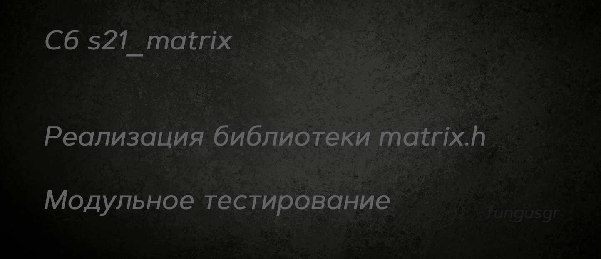

## Оглавление

* [Введение](#введение)
* [Реализация библиотеки matrix.h](#реализация-библиотеки-matrixh)  
* [Зависимости](#зависимости)
* [Сборка](#сборка)
* [Тесты](#тесты)


## Введение

Авторская реализация библиотеки matrix.h    
Тесты функций библиотеки matrix.h  

### Основные команды make  
- `make`					*сборка, тестирование и вывод отчёта*
- `make s21_matrix.a`		*собрать библиотеку matrix.h*
- `make test`				*протестировать библиотеку matrix.h*
- `make gcov_report`		*собрать отчёт о покрытии*
- `make open_report`		*открыть отчёт о покрытии*
- `make clean`				*удалить сборочные файлы*

### Проверки в make  
- `make check`				*проверить зависимости*
- `make valgrind`			*проверить утечки и джампы*
- `make cpp`				*проверить с помощью cppcheck*
- `make style`				*проверить соответствие стилю Google*

## Реализация библиотеки matrix.h

### Создание и удаление матрицы
- `void s21_remove_matrix(matrix_t *A);` - очистка матрицы
- `int s21_create_matrix(int rows, int columns, matrix_t *result);` - создание матрицы

### Арифметические операции с матрицами
- `int s21_eq_matrix(matrix_t *A, matrix_t *B);` - сравнение матриц до седьмого знака после запятой включительно
- `int s21_sum_matrix(matrix_t *A, matrix_t *B, matrix_t *result);` - сложение матриц
- `int s21_sub_matrix(matrix_t *A, matrix_t *B, matrix_t *result);` - вычитание матриц
- `int s21_mult_matrix(matrix_t *A, matrix_t *B, matrix_t *result);` - умножение двух матриц
- `int s21_mult_number(matrix_t *A, double number, matrix_t *result);` - умножение матрицы на число

### Расчет дополнительных параметров и характеристик матриц
- `int s21_determinant(matrix_t *A, double *result);` - определитель матрицы
- `int s21_transpose(matrix_t *A, matrix_t *result);` - транспонирование матрицы
- `int s21_inverse_matrix(matrix_t *A, matrix_t *result);` - инвертирование матрицы
- `int s21_calc_complements(matrix_t *A, matrix_t *result);` - вычисление комплементарной матрицы 

### Возвращаемые значения

Все операции (кроме сравнения матриц) возвращают результирующий код:  
- 0 - OK
- 1 - Ошибка, некорректная матрица   
- 2 - Ошибка вычисления (несовпадающие размеры матриц; матрица, для которой нельзя провести вычисления и т.д.)

```c
// Возвращаемые значения для сравнения матриц
#define SUCCESS 1
#define FAILURE 0
```


### Реализованы следующие требования к проекту

Разработано на языке C стандарта C11 и POSIX.1-2017 с использованием компилятора gcc.  
Код библиотеки располагается в папке src в ветке develop.  
Использован стиль разработки Google.  
Статическая библиотека реализована с заголовочным файлом `s21_matrix.h`  
Библиотека разработана в соответствии с принципами структурного программирования  
Перед каждой функцией использован префикс s21_   
Реализовано покрытие unit-тестами не менее 80% каждой функции библиотеки `s21_matrix.h` c помощью Check   
Makefile используется для сборки библиотеки и тестов, включая цели `all`, `clean`, `test`, `s21_matrix.a`, `gcov_report`  
В цели gcov_report должен формируется отчёт gcov в виде html страницы  
Матрица реализована в виде структуры  
Проверяемая точность дробной части - 6 знаков после запятой  


## Зависимости  

***Для работы программы необходим Homebrew и установленная дбиблиотека check + утилиты lcov и gcov.***  

Проверка их наличия и установка осуществляется с помощью скриптов install_brew.sh и check_gcov_lcov.sh командой `make check`  

<details>
  <summary>Команды для ручной установки</summary>

  | № | Ресурс   | Команда Linux                      | Команда MacOs |
  |---|----------|------------------------------------|----------------|
  | 1 | check.h: | sudo apt-get install check         | brew install check |
  | 2 | lcov:    | sudo apt-get install lcov          | brew install lcov |
  | 3 | gcov:    | sudo apt-get install gcov          | xcode-select --install |

  Также возможно понадобится

  | № | Команда Linux                      | Команда MacOs |
  |---|------------------------------------|----------------|
  | 1 | sudo apt-get update                | brew update    |
  | 2 | sudo apt-get install --fix-missing |                |

  Для установки Brew: `curl -fsSL https://rawgit.com/kube/42homebrew/master/install.sh | zsh`

</details>


### Использование

Для использования библиотеки необходимо скомпилировать проект, включая исходный код библиотеки и модульные тесты, с помощью Makefile.  


## Сборка

```
$ git clone  
$ cd .../src
$ git switch develop  
$ make check
$ make

```


## Тесты

Модульные и юнит-тесты реализованы при помощи библиотеки Check и утилиты gcov.  
Unit-тесты покрывают более 80% каждой функции.  
После отрабатывания всех тестов программа генерирует отчет gcov в форме html-страницы.  

После завершения работы программы с модульными тестами, проводится проверка на стиль и cppcheck. 


